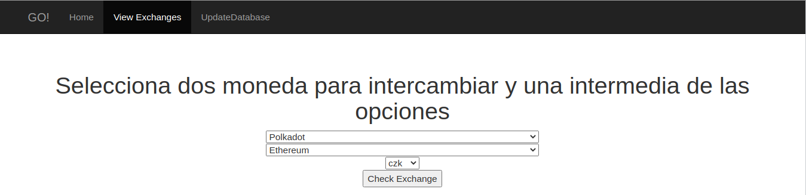

# Proyecto GO

## Consumo de API REST en GO

Escribirán un pequeño servicio web que se pueda consultar a través de un REST API, a su vez este servicio web tiene que consumir al menos 2 otros REST APIs de cualquier fuente que le interese ustedes.

Su servicio/API debe de permitir un mínimo de una consulta que resulte de mezclar la información de o acciones de los 2 (o más) APIs que estén utilizando.


## Ambiente 

Las pruebas realizadas en este proyecto fueron hechas bajo un sistema con las siguientes características:


- S.O. -> Linux Ubuntu 20.04
- Go -> 1.16.6


## Instalación

```
go mod init master.project/go
go get -u gorm.io/gorm
go get -u gorm.io/driver/sqlite
go run main.go
```

## 


## Descripcion de APIs usados

El head de API es https://api.coingecko.com/api/v3/, donde se puede notar que la API de coingecko esta en su versión número 3.


### coins/list

Esta consulta retorna una JSON con todos las las monedas incluídas en coingecko. Al ser bastante pesada por la magnitud de los datos suele tardarse, por lo que se considera grabar la información en una base local y utilizarla cada día para actualizar la información de ser necesario.

Esta API no entrega información relevante más allá de nombre, símbolo y id de la moneda.

Para actualizar la base de datos se puede acceder al endpoint

```
localhost:9000/updatedatabase
```

Se tardará un rato hasta descargar la informacion y luego agregarla crear la nueva base de datos con la informacion actualizada.

### simple/price?ids=XXXX&vs_currencies=XXX

Este endpoint trae la conversion entre una moneda y una de las posibles conversiones simples. Este endpoint es usado en:

```
http://localhost:9000/exchange?coin1=COIN1&coin2=COIN2&mid=USD
```

donde coin1 es la moneda que se desea intercambiar, coin2 la moneda a la que se desea cambiar, y mid es
la moneda intermedia.

ej:

```
http://localhost:9000/exchange?coin1=bitcoin&coin2=ethereum&mid=usd
```

Aquí se puede apreciar la forma de hacer el cambio de un bitcoin a ethereum considerando el precio de USD.

Estos cambios intermedios suelen darse en las casas de cambios por la volatilidad de las monedas frente a una moneda más estable. En ciertos casos puede ser mejor hacer cambio directo, que pasar por una moneda. Otro extra es que el doble cambio esta sujeto a la demanda y oferta de dos monedas, mientras que la directa solo de una, así mismo los costos de intereses por intercambio solo se consideraran una sola vez, y no dos.


## Como usar

una vez iniciado el servidor con ayuda de `go run main.go` se puede ir a un navegador y utilizar el servidor local para ver una pagina de `home`:

```
localhost:9000/home
```




